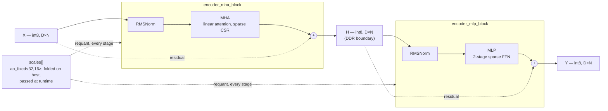

# SPARTA — Sparse Transformer Accelerator

A sparse Vision Transformer (ViT) encoder implemented in Vitis HLS C++, targeting
the Xilinx/AMD Kria KV260 (`xck26-sfvc784-2LV-c`). The encoder runs int8
activations against 4-bit sparse weights in CSR format, with all
quantization scales folded and passed as runtime arguments so a single set of
kernels serves every layer of a 12-layer ViT-Base model.

Measured by C-synthesis: **265.9 ms per image (3.76 images/s)** at the 200 MHz signoff
clock, with the hardware reproducing the software model's predictions exactly in
end-to-end C-simulation.

## Architecture

Each of the 12 encoder layers is the standard pre-norm transformer block:

```
H = X + MHA(RMSNorm(X))     (encoder_mha_block)
Y = H + MLP(RMSNorm(H))     (encoder_mlp_block)
```



*One layer's dataflow; the same kernel runs 12×, only `weights[]`/`scales[]` change
per call. The dashed lines are the pre-norm skip connections — each block adds
its own block-input, not its normalized activation — and the runtime `scales[]`
feed that lets one compiled kernel serve every layer.*

- **RMSNorm** — int8 in/out, fixed-point rsqrt via a precomputed LUT.
- **MHA** — softmax-free linear self-attention. Q/K/V/O projections are sparse
  weight x dense activation SpMM (Gustavson's algorithm, DDR-streamed CSR);
  the two activation-side products (`K'V^T`, `Q'A`) use on-chip CSR built from
  ReLU-sparsified Q'/K'.
- **MLP** — two-stage sparse feed-forward: `H = ReLU(W1.X)` (fused with ReLU,
  sparsified to CSR), `Y = W2.H` (dense output).
- **Residual** — folds each block's requant into two multiply ratios, so the
  add needs no on-chip reciprocal.

All activations are int8, feature-major (`D x N`), and quantization is
per-tensor with the scales folded on the host (see `scripts/compile_model.py`)
and passed to the kernels as `ap_fixed<32,16>` runtime arguments — no
compile-time scale constants, so the same bitstream serves all 12 layers.

## Repository layout

```
config/
  yml/            Component config sources (dims, buffer bounds, on-chip types)
  inc/            Generated C++ headers (config/yml/*.yaml -> config/inc/*.h)
  build_config.yaml   Target device / clock period
inc/
  layers/         Layer-core headers (rmsnorm, mha, mlp, residual)
  top/            Block/layer wrapper headers (encoder_mha_block, encoder_mlp_block, encoder_layer)
  helpers/        Shared LUT/quantize helpers (rsqrt, reciprocal, saturate+requant)
src/
  layers/         Layer-core implementations
  top/            Block/layer wrapper implementations (glue: RMSNorm -> core -> residual)
tb/               HLS C-simulation testbenches — see tb/README.md
scripts/
  gen_layer_config.py   config/yml/<name>.yaml -> config/inc/<name>_cfg.h
  gen_hls_config.py     config/build_config.yaml -> workspace/<project>/hls_config.cfg
  compile_model.py      Quantized model (quant_values.txt) -> FPGA runtime payload (model.bin)
runtime/          On-board host driver: PYNQ buffer allocation + MMIO kernel invocation
sim/              End-to-end simulation against the software model — see sim/README.md
```

## Model weights

The kernel needs a compiled model payload, and `sim/` needs the source checkpoint to
regenerate it. **Neither is included in this repository** (`sim/models/` is excluded — the
checkpoints are large and distributed separately). Without them, the design builds and
synthesizes, but the end-to-end simulation cannot run.

See `sim/README.md` for what the flow expects and where each artifact goes.

## Quick start

Requires Vitis HLS (with `vitis-run.bat`/`v++` in `PATH`), Python 3 with
`pyyaml`, and GNU Make.

```bash
# Generate the per-component config headers + the project's HLS config
make config PROJECT=encoder_layer

# Run C simulation
make sim PROJECT=encoder_layer

# Run HLS synthesis
make synth PROJECT=encoder_layer

# config -> sim -> synth in one go
make full PROJECT=encoder_layer
```

Two projects, both building the same kernel: `encoder_layer` (synthetic weights,
self-checking) and `encoder_e2e` (the real compiled model, checked by `sim/`) —
see [`tb/README.md`](tb/README.md). Each has a shorthand, e.g.
`make sim-encoder-layer`. Run `make help` for the full target list.

## Configuration

Two independent generators, both run automatically by `make config`:

1. **`scripts/gen_layer_config.py`** — turns each `config/yml/<name>.yaml`
   (buffer bounds, on-chip types, parallelism factors) into the matching
   `config/inc/<name>_cfg.h`. One generic generator serves every component;
   the YAML says *what* to emit, the script only knows *how*.
2. **`scripts/gen_hls_config.py`** — turns `config/build_config.yaml` (target
   device, clock period) into `workspace/<project>/hls_config.cfg`, the Vitis
   HLS project file. The output directory name selects the project.

Edit `config/build_config.yaml` for device/clock, or a component's
`config/yml/*.yaml` for its dimensions/buffer sizing, then re-run `make config`.

## Testbenches

Two C-simulation drivers, both building the same `encoder_layer_top()` sources —
`encoder_layer_tb.cpp` drives it with synthetic weights and POT4 test scales and
checks itself against a double-precision reference; `encoder_e2e_tb.cpp` drives it
with the real compiled model over whole images, with correctness decided by
`sim/check_e2e.py`. See [`tb/README.md`](tb/README.md).

## Model compilation & deployment

`scripts/compile_model.py` converts the quantized model export
(`quant_values.txt`, from the brevitas W4A8 training) into the FPGA runtime
payload (`model.bin`: per-layer CSR weights + folded scales). `runtime/`
carries that payload onto the board: `SPARTA.py` is the Python host driver —
PYNQ buffer allocation, MMIO control of `encoder_layer_top`, and the 12-layer
loop — with `SPARTALoader.py` parsing `model.bin` into the per-layer buffers and
`infer_hw.py` wrapping the whole thing as an end-to-end image classifier.

`sim/` runs whole images through the kernel in C-simulation and checks that the
hardware classifies them identically to the software model — see
[`sim/README.md`](sim/README.md).

## Requirements

- Vitis HLS 2023.x+ (`vitis-run.bat` / `v++` in `PATH`)
- Python 3 with `pyyaml` (config generation); `numpy` for `sim/`; PYNQ on-device for `runtime/`
- GNU Make

The `sim/` end-to-end flow additionally needs the software model's environment (PyTorch +
Brevitas) for the embedding and classifier head that sit either side of the accelerator —
see `sim/README.md`.

## License

See [LICENSE](LICENSE).
